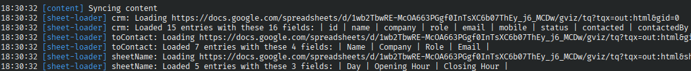
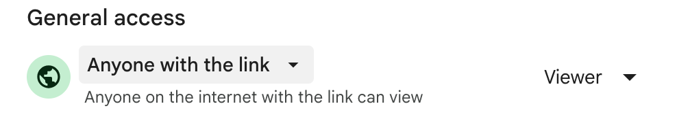

# Astro Sheet loader

This package provides a Google Sheets loader for Astro. It allows you to load and parse publicly viewable Sheets, and use the data in your Astro site.

Data is fetched using the [Google Visualization API](https://developers.google.com/chart/interactive/docs/reference) (gviz).



## Sheet preparation

In Google Sheets, create a document, give it a name and write some tabular data.

Recommended: Click Format > Convert to Table, choose the appropriate column type and make sure that there are no different data types within the same column.

Edit the Share settings of the document, so that "Anyone on the internet with the link can view".



From the URL bar, copy the document ID and optionally the gid (grid ID) of the sheet you want to fetch data from.


## Installation

```sh
npm install astro-sheet-loader
```

## Usage

This package requires Astro 6 or later.

You can then use the feed loader in your content configuration:

```typescript
// src/content.config.ts
import { defineCollection } from "astro:content";
import { sheetLoader } from "astro-sheet-loader";
// optionally import a transform function
import { camelCase, snake_case } from "astro-sheet-loader";

const crm = defineCollection({
  loader: sheetLoader({
    document: "1wb2TbwRE-McOA663PGgf0InTsXC6b07ThEy_j6_MCDw",
  }),
  // if you don't define a schema yourself, it will be automatically generated
  // schema: z.object({
  //
  //})
});

export const collections = { crm };
```

You can then use these like any other content collection in Astro:

```astro
---
import type { GetStaticPaths } from "astro";
import { getCollection, type CollectionEntry } from "astro:content";

const entries: CollectionEntry<"crm">[] = await getCollection("crm");
---

<html lang="en">
  <head>
    <meta charset="utf-8" />
    <title>Astro Sheet Loader</title>
  </head>
  <body>
    <h1>Table generated from Astro Sheet Loader</h1>
    <table>
      <tr id="columns">
        {Object.keys(entries[0].data).map((column) => (
          <th>{column}</th>
        ))}
      </tr>
      {entries.map((row) => (
        <tr id={row.id}>
          {Object.values(row.data).map((value) => (
            <td>{value}</td>
          ))}
        </tr>
      ))}
    </table>
  </body>
</html>
```

## Options

The `sheetLoader` function takes an options object with the following properties:

- `document` (mandatory): The Google Sheet document ID, found in the URL
- `gid` (optional, default: first sheet): Number identifying the sheet, found in the URL
- `sheet` (optional, default: first sheet): The name of the sheet, found at the bottom of the page
- `range` (optional, default: select all): Range of cells to delimit the table
- `query` (optional, default: select all): SQL-like query to filter results in the provided range, using the original column names. [Query documentation](https://developers.google.com/chart/interactive/docs/querylanguage)
- `allowBlanks` (optional, default: all fields are mandatory): Allow for blank cells, either in the whole table (`true`) or in specific columns (e.g. `["notes", "mobile"]`, named after `transformHeader` is applied)
- `transformHeader` (optional, default: `false`): Pass a function like `camelCase` or `snake_case` or a custom defined one to transform column names
- `idColumn` (optional, default: positional `row_N` IDs): Use the values of this column as entry IDs, so that they stay stable when rows are inserted or deleted. The name must match the column after `transformHeader` is applied, and its values must be unique and non-empty

## Live collections

For SSR sites, the `sheetLiveLoader` function fetches the Sheet at request time instead of build time. It takes the same options as `sheetLoader`, except for `allowBlanks`, as live collections do not validate entries against a generated schema:

```typescript
// src/live.config.ts
import { defineLiveCollection } from "astro:content";
import { sheetLiveLoader } from "astro-sheet-loader";

const crm = defineLiveCollection({
  loader: sheetLiveLoader({
    document: "1wb2TbwRE-McOA663PGgf0InTsXC6b07ThEy_j6_MCDw",
    idColumn: "Name",
  }),
});

export const collections = { crm };
```

```astro
---
import { getLiveCollection, getLiveEntry } from "astro:content";

const { entries } = await getLiveCollection("crm");
const { entry } = await getLiveEntry("crm", "Alice");
---
```

Live collections require an [on-demand rendering adapter](https://docs.astro.build/en/guides/on-demand-rendering/).

## Caveat

### Types

The schema will be generated automatically if not user-specified when defining the collection in Astro.

However, you should be aware of the following:

- numbers, booleans and strings are imported with their original type
- currencies, percentages and monetary values are imported as raw numbers
- dates, times, datetimes and durations are imported as strings as they appear in the sheet
- checkboxes are imported as booleans
- smart chips are imported as strings
- functions are imported as their return value

### Warnings and errors

- if the provided sheet or gid do not exist, Google will silently return data for the default sheet (the one with gid 0)
- if the range or query do not return any entries, the loader will throw a warning
- if the document is not publicly viewable or does not exist, the loader will throw an error
- if an entry does not respect the user-provided or auto-generated schema, the loader will throw an error

### Inaccurate API response

Despite doing everything correctly, the Sheets API may return inaccurate data:

- empty column names [Example](https://docs.google.com/spreadsheets/d/1wb2TbwRE-McOA663PGgf0InTsXC6b07ThEy_j6_MCDw/gviz/tq?tqx=out:html&sheet=log_data)
- all entries are part of the column name [Example](https://docs.google.com/spreadsheets/d/1wb2TbwRE-McOA663PGgf0InTsXC6b07ThEy_j6_MCDw/gviz/tq?tqx=out:html&sheet=logs)
- unnecessary, completely blank columns [Example](https://docs.google.com/spreadsheets/d/1h-oqlqJ_G3UXuDSkdFHuEaCVuOXQOb68y2sduXQRTn4/gviz/tq?tqx=out:html)

If you have an idea on how to tackle these cases, feel free to submit a PR!

## Development

- `npm test` builds the package and runs the offline test suite against recorded fixtures
- `npm run test:online` also builds the demo and runs the tests hitting the live Google Sheets API

## Special Thanks

Kudos to Matt Kane for his [collection of Astro Loaders](https://github.com/ascorbic/astro-loaders)
